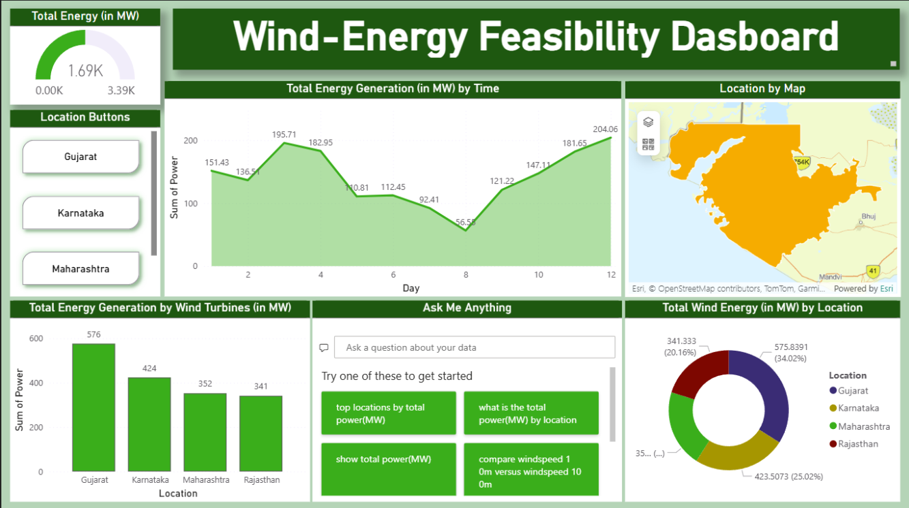
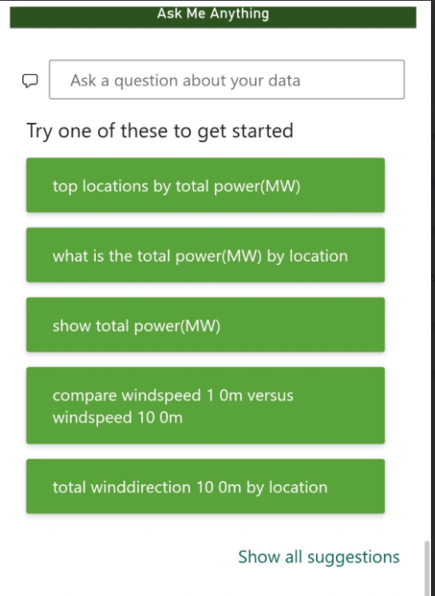
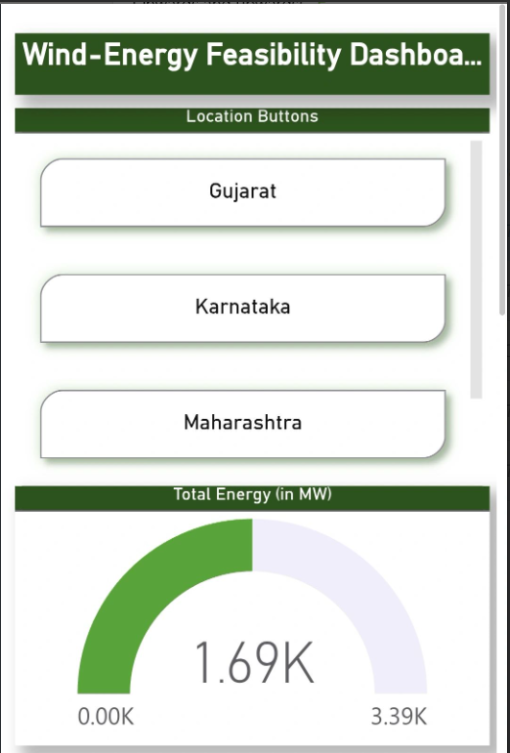
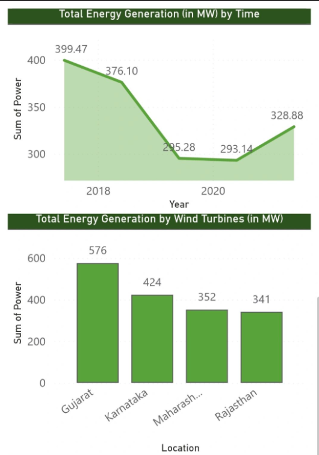
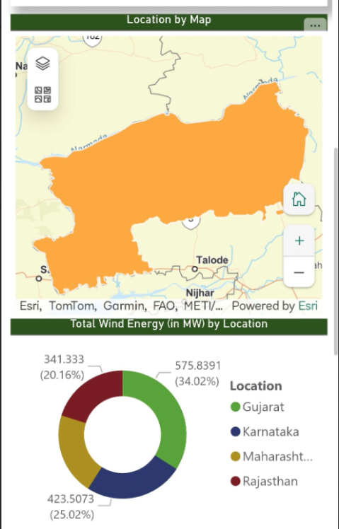

# 🌬️ Wind Energy Feasibility Dashboard

## 📌 Overview
This project focuses on analyzing wind energy potential using data visualization techniques. The goal is to support decision-making for renewable energy adoption by providing insights into wind speed, energy output, and site feasibility.

## 🚀 Problem Statement
Small-scale wind energy projects often lack simple tools to evaluate feasibility. This project addresses that gap by creating an interactive dashboard to analyze wind energy data.

## 💡 Solution
Developed a Wind Energy Feasibility Dashboard to:
- Analyze wind speed and energy generation data  
- Identify high-potential locations for wind projects  
- Support data-driven decisions for stakeholders  

## 🛠️ My Contribution
- Performed data cleaning and preprocessing  
- Conducted research and analysis on wind energy datasets  
- Prepared structured data and documentation for dashboard development  

## 📊 Features
- Interactive data visualizations  
- Insights into wind speed and energy output  
- User-friendly dashboard for better understanding  

## 🧰 Technologies Used
- Power BI  
- Tableau (basic)  
- Google Forms  
- Data Analysis  

## 📈 Impact
- Supported evaluation of wind energy potential across multiple locations  
- Enabled better planning for clean energy adoption  
- Contributed to data-driven environmental decision-making
## 📸 Dashboard Screenshots

 
 
 

## 📎 Project Resources
- 📊 Dashboard & Files:(🔐 Note:Google drive links)
- Final Project Report(Word Document) :https://drive.google.com/file/d/1dgMo34u161bjbflkFWWJgpmyqWeN1ov9/view?usp=drive_link
- Final PPT (PDF) :https://drive.google.com/file/d/1wPT3m15KTmeDEKMB671zrdZlGMtmr8yE/view?usp=drive_link
- Project Explanation Video :https://drive.google.com/file/d/1UJ3M4wr94uIcp8W8FvDZKzFvAHvc8-OP/view?usp=drive_link

## 🤝 Team
- Vasamsetti Geetha Sandhya  
- Md Usman Ansari  

## 📚 Learnings
- Gained hands-on experience in data analysis and visualization  
- Improved understanding of renewable energy systems  
- Developed teamwork and communication skills  

---
